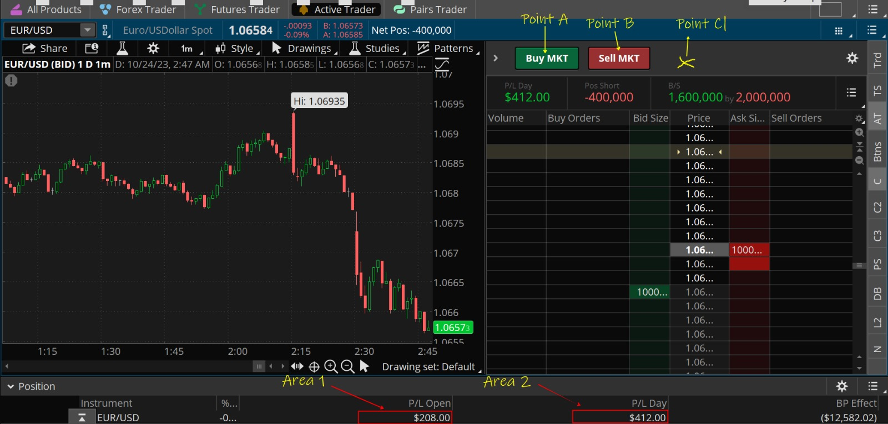
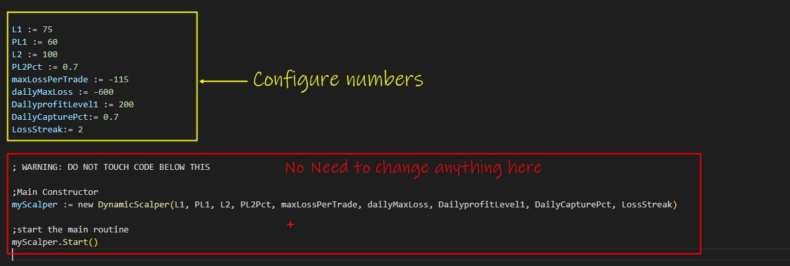

# Dynamic Scalper

Dynamic Scalper is the most advanced and easy-to-customize trading strategy added by Nightshark. It uses 9 parameters where users can customize it based on their needs and create their own trading bot.

## Setup

Users are required to configure areas and setup in the following way:

| **Point** | **Description**                                        |
|-----------|--------------------------------------------------------|
| point.a   | BUY button                                             |
| point.b   | SELL button                                            |
| point.c   | Some random area where clicking has no effect          |
| Area[1]   | P/L Open (P/L of the current Open trade)               |
| Area[2]   | P/L Day (area around daily P/L)                        |





## Example Usage



```python
; Configure your numbers below
L1 := 75 
PL1 := 60
L2 := 100 
PL2Pct := 0.7 
maxLossPerTrade := -115
dailyMaxLoss := -600
DailyprofitLevel1 := 200
DailyCapturePct:= 0.7
LossStreak:= 2

; WARNING: DO NOT TOUCH CODE BELOW THIS

; Main Constructor
myScalper := new DynamicScalper(L1, PL1, L2, PL2Pct, maxLossPerTrade, dailyMaxLoss, DailyprofitLevel1, DailyCapturePct, LossStreak)

; Start the main routine
myScalper.Start()
```

## Parameters

 **L1**  
   First profit amount where a new trailing stop loss will be created.

 **PL1**  
   The trailing stop for the first profit level.

   In this example, when Nightshark recognizes the P/L of the current trade went above $75, it will set up a stop loss at $60. If P/L drops below $60, Nightshark will close the current trade and start a new one. This is designed to capture minimal gains if market conditions are fairly sideways and there is not much momentum in the direction of trade.

 | **L2** |
 **PL2Pct**  
   Trailing stop loss % for the second profit level.

   In this example, if P/L for the current trade reaches above $100, the minimum profit capture will be ($100 * 0.7 = $70). This stop loss will be dynamic, meaning if P/L reaches $200, the new stop loss sits at ($200 * 0.7 = $140). If P/L drops below $140, Nightshark will close the trade. This is designed to capitalize when there is strong momentum in the trade direction.

 **maxLossPerTrade**  
   Maximum loss per trade. If P/L crosses below -$115, Nightshark will close the trade and mark it as a loss.

 **dailyMaxLoss**  
   Daily maximum loss. If the Daily P/L crosses this threshold, Nightshark will stop the script and halt the algorithm.

 **DailyprofitLevel1**  
   Daily profit level 1.

 **DailyCapturePct**  
   Trailing stop loss % for daily P/L.

   While PL1 is for P/L for each trade, DailyprofitLevel is for the stop loss for the DailyPnL. DailyCapturePct is designed to set trailing stop loss on Daily P/L. In this example, once there is a Daily profit of $200 and if it reaches below ($200 * 0.7 = $140), Nightshark will stop the trading and halt the algorithm.

9. **LossStreak := 2**  
   The number of losses after which you want to reverse the trading. In this example, the loss streak is 2. Imagine you go LONG, and 2 consecutive trades hit MaxLossPerTrade. Then Nightshark will start taking SHORT positions.
