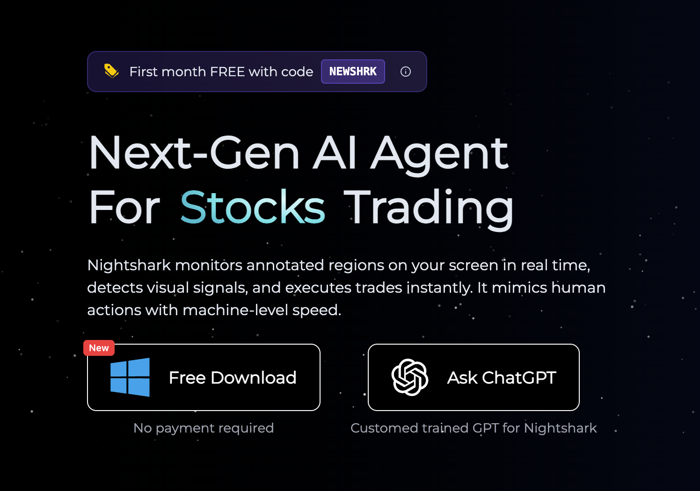
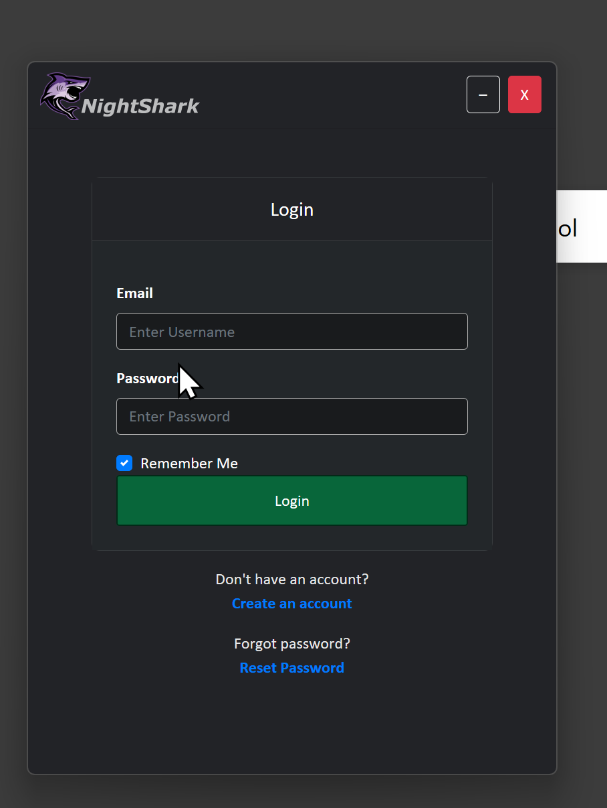
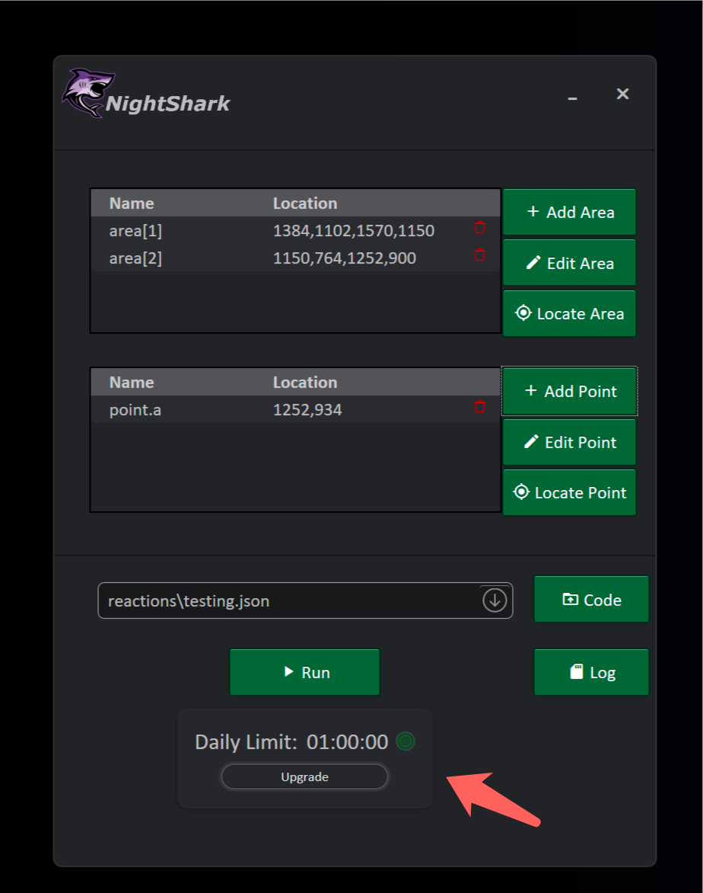
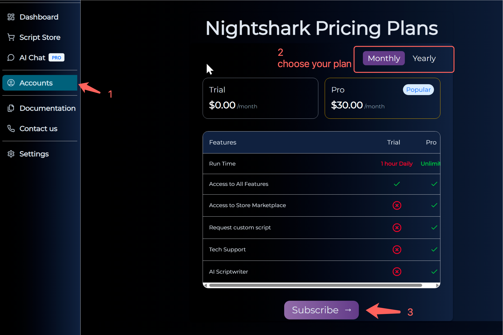

# NightShark Desktop Installation

This guide walks you through every step required to install the NightShark desktop application on a Windows PC, activate your account, and confirm that the platform is ready for live trading.

## Before You Begin

- A Windows 10 or 11 computer with administrator access  
- A NightShark account email you can verify immediately  
- A stable internet connection to complete downloads and activation

:::tip Need a quick start?
Keep the NightShark portal open in a browser tab—you will switch between the desktop installer and the web dashboard throughout the setup.
:::

## Phase 1 — Download and Register

1. **Visit the NightShark website**  
   Go to [nightshark.io](https://nightshark.io). NightShark is currently available only for Windows.  

2. **Download the desktop installer**  
   From the homepage, click the download button to grab the latest NightShark setup file.

  

3. **Create your NightShark account**  
   While the installer downloads, open the [registration form](https://nightshark.io/#/register). Provide your information, accept the terms, and submit the signup form.

   

4. **Verify your email address**  
   NightShark sends a verification email within a minute. Click the verification link to activate your portal access before proceeding.

## Phase 2 — Install the Desktop App

5. **Sign in to the portal and download the ZIP package**  
   Log in at [nightshark.io](https://nightshark.io) with your new credentials. Download the NightShark ZIP archive from the dashboard and extract it to a convenient folder.

6. **Sign in from the desktop app**  
   When the NightShark login window appears, enter the same email and password used on the website. Select **Remember me** if you want NightShark to cache your credentials securely.

 

7. **Daily limit for Free users**  
   We allow daily 1 hour of runtime for you to test drive our software for free. with this you would be able to check the compatibility of our software with your desktop before you sign up for a subscription.

 

   

## Phase 3 — Activate Your Account

8. **Trigger the activation flow**  
   If you see an “Activate your account” prompt in the desktop app, switch back to the web portal. From the sidebar, open **Activate Your Account** and follow the on-screen instructions.

   

9. **Complete payment**  
   You will be redirected to the secure Stripe checkout. Enter your billing details and submit the payment request.

   

## Phase 4 — Validate Your Setup

10. **Reopen the Nightshark desktop app**  
    After logging in, You should see the time restriction being removed.

   

:::info What’s next?
Explore the strategy templates inside the app or continue with the tutorials in this documentation to build your first automated workflow.
:::