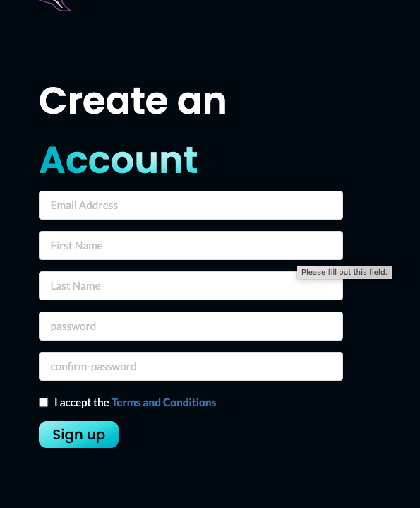
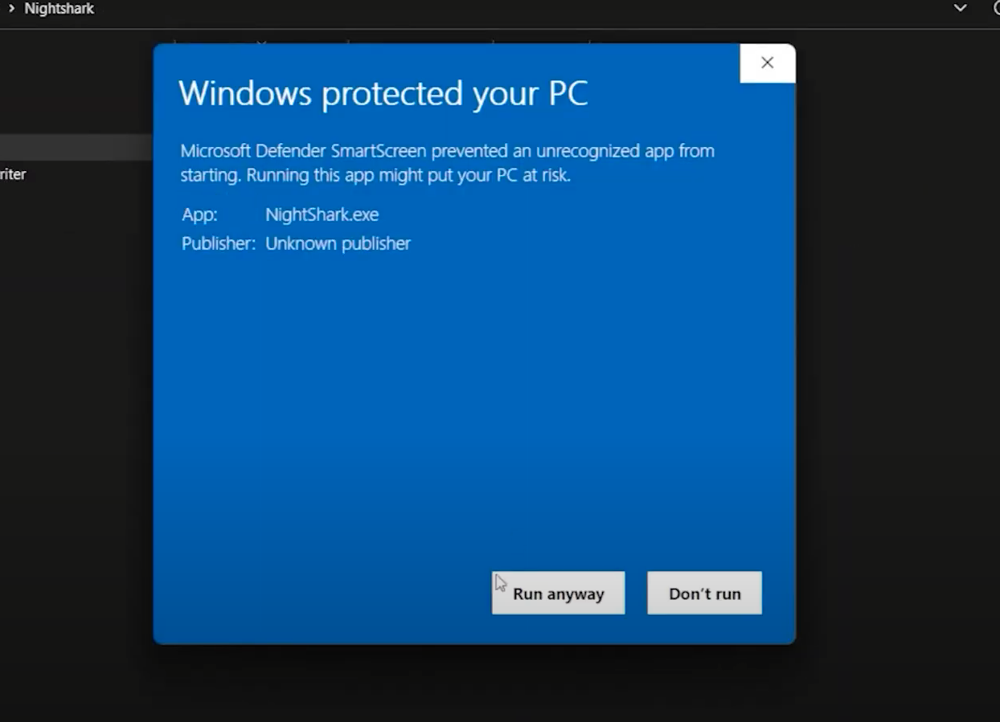
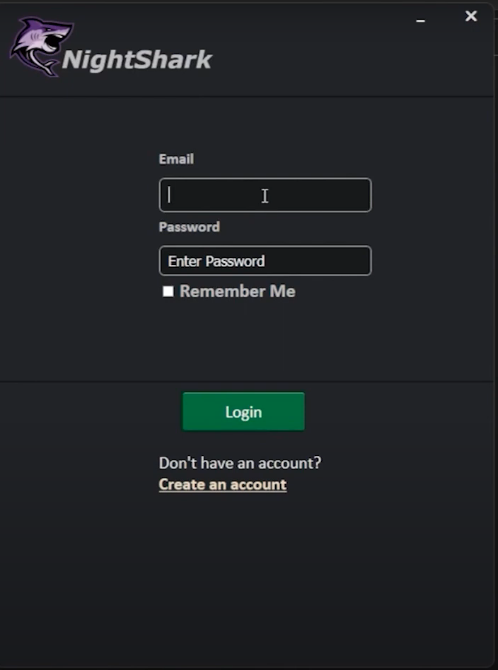
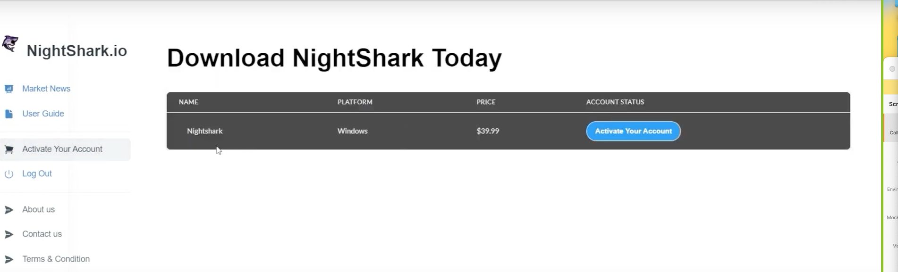
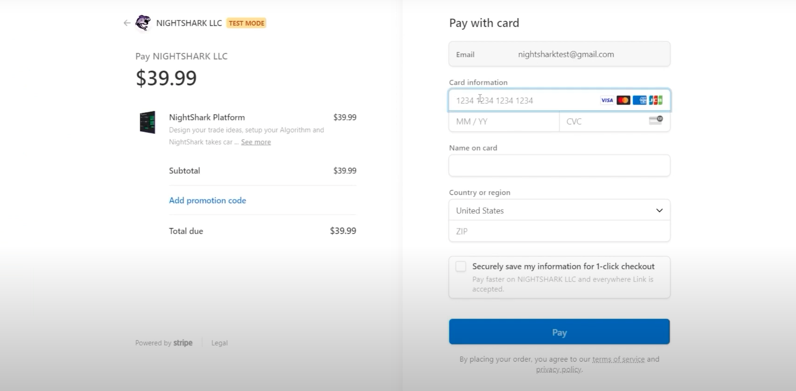
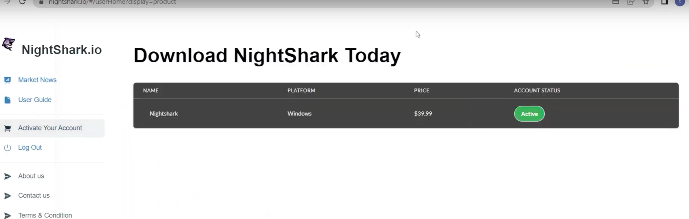
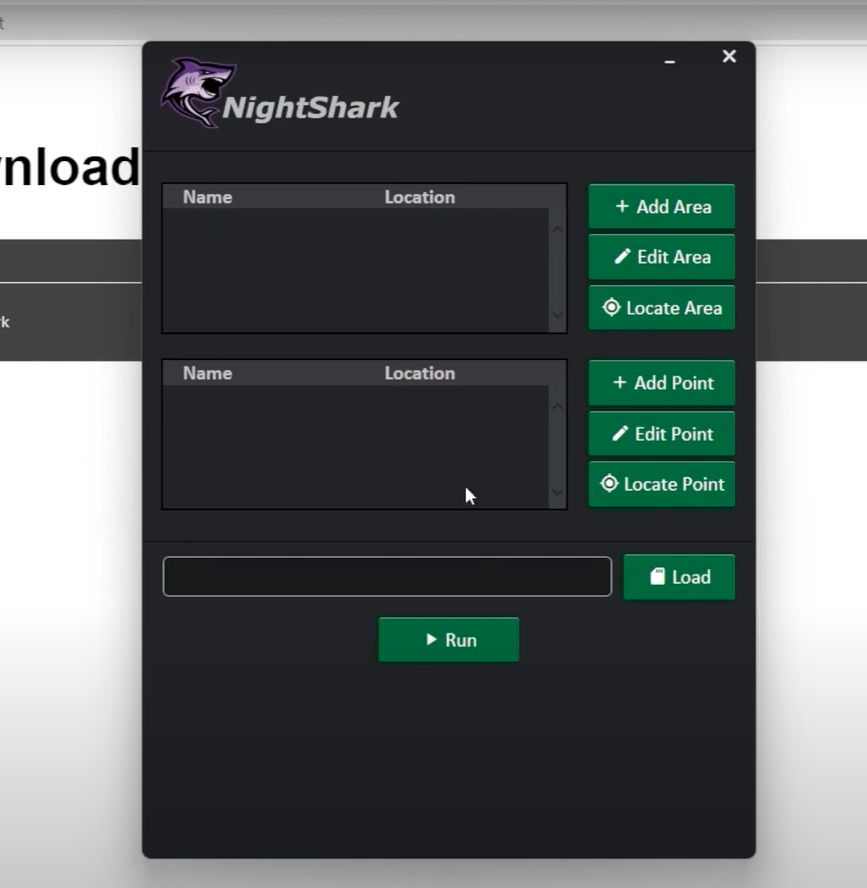

# Installation
In this article, we'll walk you through the process of setting up the NightShark desktop application on your Windows PC. Let's get started!

## Step 1: Visit the NightShark Website

Begin by visiting the official [NightShark website](https://nightshark.io). Please note that as of now, NightShark is exclusively available for Windows PC.

## Step 2: Download the Installation File

While on the website, navigate to the home page and download the installation file for NightShark.

## Step 3: Registration

As the installation file downloads, let's go ahead and complete the registration process. For the sake of this guide, we've created a test email. Provide your information, carefully review the terms and conditions, and proceed to sign up.
you can use the [registration link ](https://nightshark.io/#/register)
 to proceed with the registration.

## Step 4: Email Verification

Upon signing up, you'll receive a verification email in your inbox. Follow the provided instructions to verify your email address. Once verified, you'll receive a confirmation of success.

## Step 5: Downloading the Zip File

With your email verified, you're now ready to download the installation file. Enter your password, and after logging in, proceed to download the "Zip file." Open it using your preferred method and extract its contents.

## Step 6: Explore the Extracted Directory

After extracting the contents of the "zip file," open the extracted directory. You may encounter a pop-up message since we are not yet registered as publishers. Simply bypass this by choosing "Run Anyway."

## Step 7: Logging In

The NightShark application login page will appear. Utilize the same credentials you used during the website registration process. If you prefer not to enter your password each time, select the "Remember Me" option.

## Step 8: Account Activation

If you receive a prompt to activate your account, it signifies that your registration is complete but requires activation. To proceed, login to your [nightshark.io](https://nightshark.io) website and login with your credentials. Once logged in, click on **Activate Your Account** link from the sidebar. You should see a button that says Activate your Account.

Once you click on the button, you will be redirected to strip page where you can make your payment.

## Step 9: Payment and Activation

Once your payment is successfully processed, your NightShark account will be automatically activated. Fill in the necessary details, complete the payment, and then proceed to verify your dashboard. You'll notice that your account status is now "active,".

## Step 10: Testing the Application

 On the main application page, ensure that you are able to login to NightShark Desktop application and can view the NightShark Dashboard.
